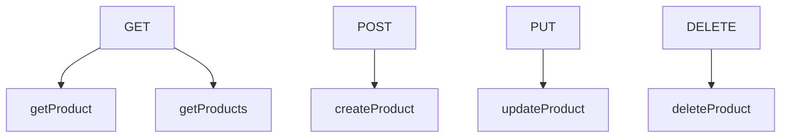
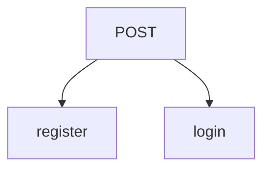
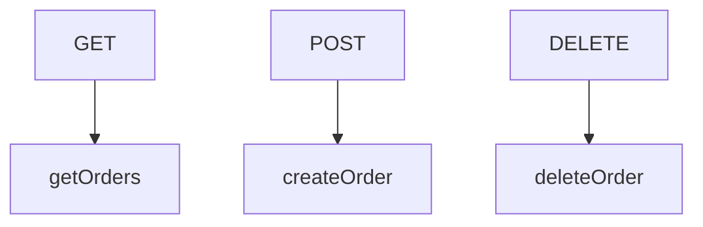

# Mall - Spring Boot

#### Aji Hsu

##### Course: Java 工程師必備！Spring Boot 零基礎入門

---

# API

## Product

>**common prefix url: `/products`**

### Graph of Http Method & Controller

### Request And Url

| method | query         | url                                          | parameters         | request body   |
| ------ |:------------- |:-------------------------------------------- |:------------------ |:-------------- |
| GET    | getProduct    | `http://localhost:8080/products/{productId}` | ProductQueryParams | x              |
| GET    | getProducts   | `http://localhost:8080/products`             | x                  | x              |
| POST   | createProduct | `http://localhost:8080/products`             | x                  | ProductRequest |
| PUT    | updateProduct | `http://localhost:8080/products/{productId}` | x                  | ProductRequest |
| DELETE | deleteProduct | `http://localhost:8080/products/{productId}` | x                  | x              |

### Dto
* ProductQueryParams (params you can choose from)
    * ProductCategory category
    * String search
    * String orderBy
    * String sort
    * Integer limit
    * Integer offset
* ProductRequest (variables required in json body)
    * \[NotNull\]String productName
    * \[NotNull\]ProductCategory category
    * \[NotNull\]String imageUrl
    * \[NotNull\]Integer price
    * \[NotNull\]Integer stock
    * String description

## User

>**common prefix url: `/users`**

### Graph of Http Method & Controller

### Request And Url

| method | query    | url                                    | parameters | request body        |
| ------ |:-------- |:-------------------------------------- |:---------- |:------------------- |
| POST   | register | `http://localhost:8080/users/register` | x          | UserRegisterRequest |
| POST   | login    | `http://localhost:8080/users/login`    | x          | UserLoginRequest    |

### Dto

* UserRegisterRequest
    * \[NotBlank\]\[Email\]String email
    * \[NotBlank\]String password
* UserLoginRequest
    * \[NotBlank\]\[Email\]String email
    * \[NotBlank\]String password

## Order

>**common prefix url: `/users/{userId}/orders`**

### Graph of Http Method & Controller

### Request And Url

| method | query       | url                                                 | parameters       | request body       |
| ------ |:----------- |:--------------------------------------------------- |:---------------- |:------------------ |
| GET    | getOrders   | `http://localhost:8080/users/{userId}/orders`       | OrderQueryParams | x                  |
| POST   | createOrder | `http://localhost:8080/users/{userId}/orders`       | x                | CreateOrderRequest |
| DELETE | deleteOrder | `http://localhost:8080/users/userId/orders/orderId` | x                | x                  |

### Dto

* OrderQueryParams
    * Integer userId
    * Integer limit
    * Integer offset
* CreateOrderRequest
    * \[NotEmpty\]List<BuyItem> buyItemList